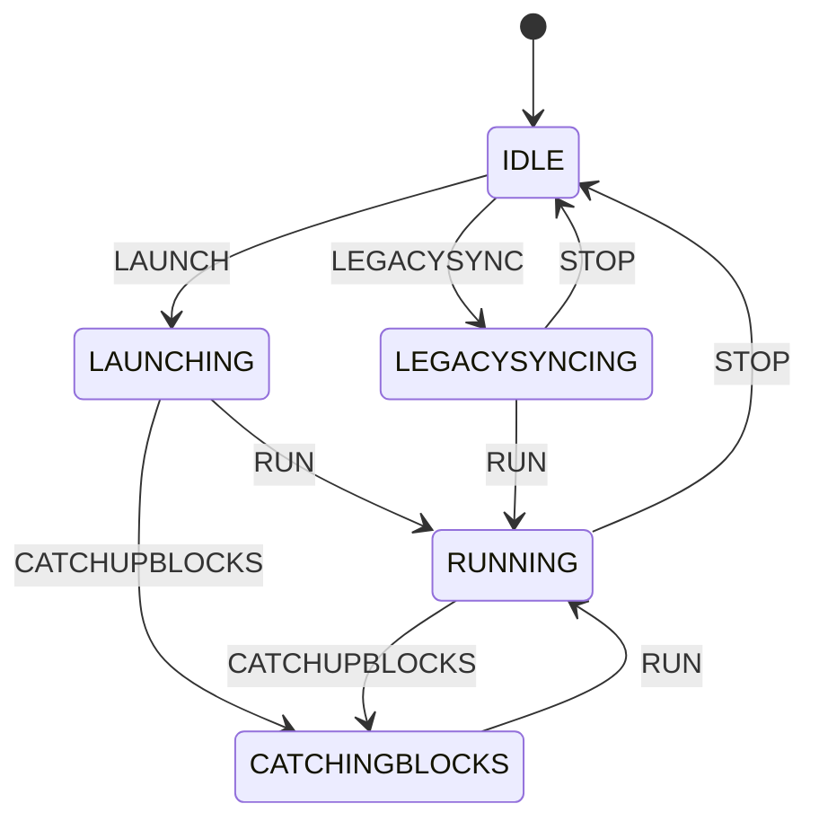

# State Machine

The mermaid diagram outlined below represents the various states and events that dictate the functionality of the node.

## Interactive Diagram

## States

- **IDLE**: Node is stopped and not processing. Operator must trigger LAUNCH to start.
- **LAUNCHING**: Node is performing initial sync check before processing. Auto-transitions to RUNNING (if synced) or CATCHINGBLOCKS (if behind peers).
- **RUNNING**: Node is fully operational and processing transactions/blocks.
- **CATCHINGBLOCKS**: Node is catching up with the network by downloading blocks from peers.
- **LEGACYSYNCING**: Node is syncing using the legacy Bitcoin protocol (for connecting to legacy nodes).
