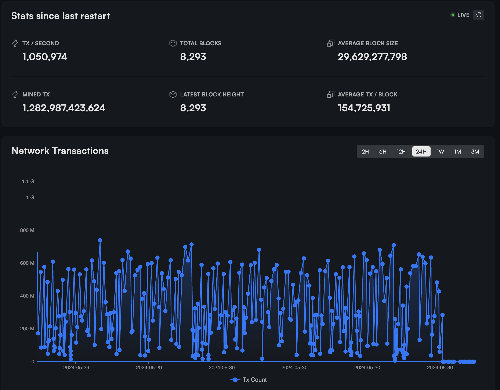
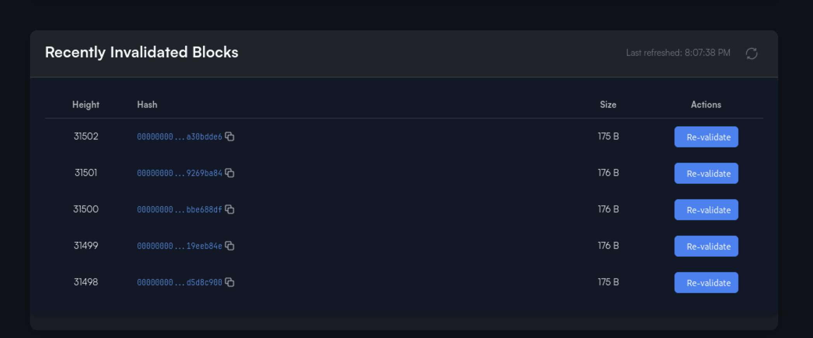
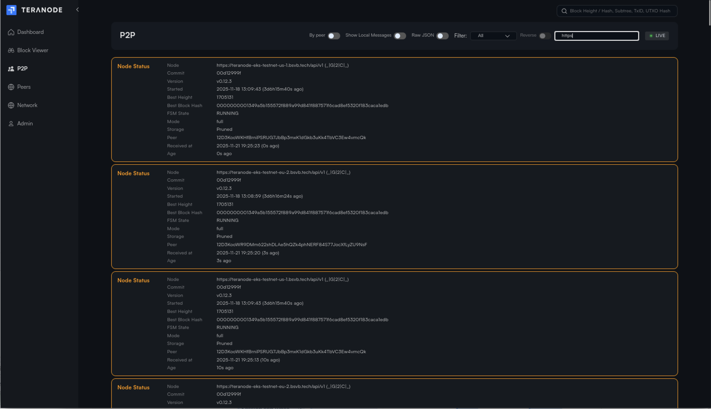
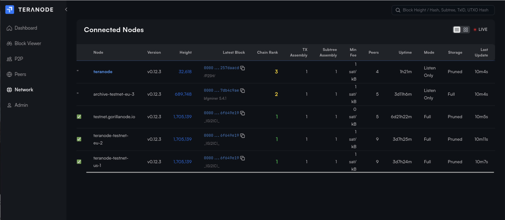
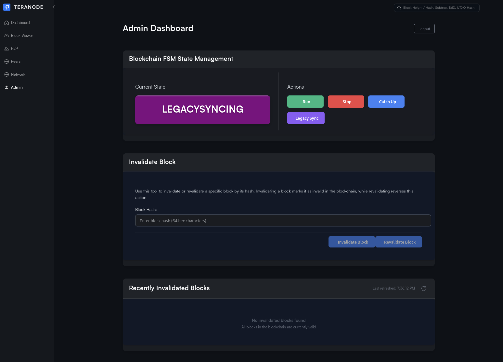
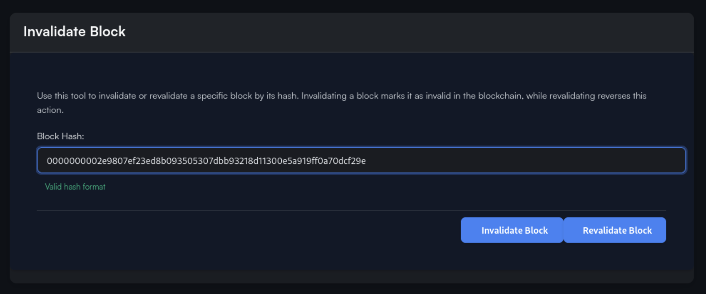

# Teranode Dashboard

## Index

1. [Overview](#1-overview)
2. [Features](#2-features)
    - [2.1. Home](#21-home)
    - [2.2. Blockchain Viewer](#22-blockchain-viewer)
    - [2.3. P2P Message Monitor](#23-p2p-message-monitor)
    - [2.4. Peers](#24-peers)
    - [2.5. Network Status](#25-network-status)
    - [2.6. Forks](#26-forks)
    - [2.7. Admin](#27-admin)
    - [2.8. WebSocket Test](#28-websocket-test)
3. [Technology](#3-technology)
4. [Running the Dashboard](#4-running-the-dashboard)
5. [Configuration](#5-configuration)
6. [Related Documentation](#6-related-documentation)

## 1. Overview

The Teranode Dashboard is a web-based user interface for monitoring and managing Teranode nodes. Built with SvelteKit and TypeScript, it provides real-time visibility into blockchain state, network peers, P2P connections, and administrative operations.

The dashboard connects to the Teranode Asset Server via HTTP and WebSocket APIs to retrieve data and receive live updates about blockchain events, peer status, and system health.

**Key Capabilities:**

- Real-time blockchain state monitoring
- FSM (Finite State Machine) management and state transitions
- Block invalidation and revalidation
- Peer connection and reputation management
- Block, transaction, UTXO, and subtree viewing
- Merkle proof visualization (BRC-74 BUMP format)
- P2P message monitoring and filtering
- Fork visualization and chain analysis
- WebSocket-based live updates

## 2. Features

### 2.1. Home



The home page (`/home`) provides an overview of the node's current state:

**Block Statistics Card:**

- Block count and transaction count
- Maximum chain height
- Average block size
- Average transactions per block
- Transactions per second
- Chain work (proof-of-work)
- Manual refresh (Ctrl+R keyboard shortcut)

**Block Graph:**

- Interactive visualization of block data
- Configurable time periods (24h, 7d, etc.)

### 2.2. Blockchain Viewer

The viewer page (`/viewer`) allows inspection of blockchain data with multiple specialized views:

**Block Viewer** (`/viewer/block?q={hash}`):

- Block details: hash, height, timestamp, miner info
- Transaction count and block size
- Merkle root and previous block hash
- Coinbase transaction details
- Subtree structure information
- Link to block ancestors

**Transaction Viewer** (`/viewer/tx?q={hash}`):

- Transaction details: hash, block height, timestamp
- Input and output counts
- UTXO details for inputs and outputs
- **Merkle Proof Visualizer**: Interactive BRC-74 BUMP (BSV Unified Merkle Path) format visualization

**UTXO Viewer** (`/viewer/utxo?q={hash}:{index}`):

- Outpoint information (txid:vout)
- Value and script pubkey
- Spending status
- UTXO metadata

**Subtree Viewer** (`/viewer/subtree?q={hash}`):

- Subtree details and metadata
- Merkle tree visualization
- List of transactions in subtree

**Blocks Table:**

- Paginated list of recent blocks
- Sortable columns
- Clickable links to block details



**Search Functionality:**

- Search by block height, block hash, transaction ID, or UTXO outpoint

### 2.3. P2P Message Monitor



The P2P page (`/p2p`) provides real-time monitoring of P2P network messages:

**Message Capture:**

- Real-time WebSocket message streaming
- Live/Paused toggle for snapshot viewing

**Filtering Options:**

- Filter by message type (dropdown with discovered types)
- Reverse filter (exclude specific types)
- Free-text search across: type, hash, URL, miner, client_name, peer_id, fsm_state, version
- Toggle to show/hide local node messages

**View Modes:**

- **By Peer**: Messages grouped by peer ID with collapsible sections
- **By Time**: Chronological linear view of all messages

**Display Options:**

- Raw JSON mode toggle
- Expandable message content
- Connection status indicator
- Message count tracking

### 2.4. Peers


The peers page (`/peers`) provides comprehensive peer management with the reputation system:

**Peer Table:**

| Column | Description |
|--------|-------------|
| Peer ID / Client Name | Identifier with tooltip showing full peer ID |
| Height | Peer's reported blockchain height |
| Reputation Score | Color-coded score (excellent/good/fair/poor) |
| Metrics | Link to view detailed catchup metrics |
| Bytes Received | Data received from peer |
| DataHub URL | Peer's data hub endpoint |

**Peer Statistics:**

- Total peers count
- Connected peers count
- Good reputation peers count

**Features:**

- Sortable columns (click to sort, reverse toggle)
- Configurable pagination (5-100 items per page)
- Live status indicator

**Catchup Details Modal** (click "View" in Metrics column):

Performance Metrics:

- Reputation score (0-100)
- Success rate percentage
- Total attempts, successes, failures
- Malicious count
- Average response time

Last Activity:

- Last attempt timestamp
- Last success timestamp
- Last failure timestamp
- Last catchup error (if any)

Peer Information:

- Full peer ID
- Client name
- Current height
- DataHub URL

**Catchup Status Bar** (shown during blockchain synchronization):

- Animated progress indicator
- Syncing peer ID and URL
- Target block hash and height
- Starting height and progress (blocks validated / total)
- Progress percentage with visual bar
- Fork depth (if syncing a fork)
- Common ancestor information
- Previous attempt failure details (error type, duration, blocks validated)

### 2.5. Network Status



The network page (`/network`) shows connected nodes with real-time WebSocket updates:

**Connected Nodes Table:**

| Column | Description |
|--------|-------------|
| Client Name | Node identifier (current node highlighted) |
| Best Height | Node's chain tip height |
| Best Block Hash | Current best block with miner info |
| Chain Rank | Chainwork score for ranking |
| FSM State | Current state machine state |
| Connected Peers | Number of connected peers |
| Uptime | Relative uptime display |

**Features:**

- Chainwork score calculation for visual ranking
- Multiple sort options
- Configurable pagination
- Live status indicator
- Real-time updates via WebSocket

### 2.6. Forks

The forks page (`/forks`) displays blockchain fork visualization for a specific block.

**Accessing the Forks Page:**

This page is accessed from the Block Viewer. When viewing a block's details, click the "forks" link in the Block Details Card to see the fork tree for that block.

**Features:**

- **Tree Visualization**: Interactive fork tree with configurable orientation (left-to-right, top-to-bottom, etc.)
- **Fork Explorer**: View alternative chain paths branching from the selected block
- **Responsive Layout**: Orientation changes based on device
- **Interactive Nodes**: Click on blocks in the tree to explore

### 2.7. Admin



The admin page (`/admin`) provides administrative operations. **This page requires authentication.**

#### FSM (Finite State Machine) Management

**Current State Display:**

- Shows blockchain state: IDLE, RUNNING, CATCHING BLOCKS, LEGACY SYNCING, DISCONNECTED

**State Transitions:**

| Event | Description |
|-------|-------------|
| RUN | Start blockchain processing |
| STOP | Stop blockchain (transition to IDLE) |
| CATCHUPBLOCKS | Enter block catchup mode |
| LEGACYSYNC | Enter legacy sync mode |

- Dynamic button UI showing available events for current state
- Custom event submission

#### Block Invalidation and Revalidation

**Invalidate Block:**



- Input field for block hash (64 hex characters)
- Real-time validation feedback (valid/invalid format)
- Mark any block as invalid

**Revalidate Block:**

- Input field for previously invalidated block hash
- Re-validate and restore block to valid state

**Invalid Blocks List:**

- Table showing last 5 invalidated blocks
- Columns: Height, Hash (link to viewer), Size
- Quick re-validate button for each block

#### Peer Reputation Management

**Reset Peer Reputations:**

- Reset all peer reputation scores to neutral (50.0)
- Clears all interaction metrics
- Useful for fresh start after network issues

### 2.8. WebSocket Test

The WebSocket test page (`/wstest`) provides connection testing tools:

- Configurable WebSocket URL
- Connect/Disconnect controls
- Real-time message capture
- Connection log with timestamps
- Raw message display
- Message count tracking
- First node_status logging

## 3. Technology

The dashboard is built with modern web technologies:

### Framework and Language

- **SvelteKit**: Full-stack framework for building web applications
- **TypeScript**: Type-safe JavaScript for improved developer experience
- **Vite**: Fast build tool and development server

### UI Components

- **D3.js**: Data visualization library for charts and graphs
- **ECharts**: Rich interactive charting library
- **Custom Svelte Components**: Reusable UI components in `/src/lib/`

### State Management

- **Svelte Stores**: Reactive state management
    - `authStore`: Authentication state
    - `listenerStore`: WebSocket event listeners
    - Node and P2P data stores

### API Integration

- **REST API**: HTTP endpoints for data retrieval
- **WebSocket**: Real-time updates for blockchain events
- **i18n**: Internationalization support via `svelte-i18next`

### Build Configuration

- **Static Adapter**: Builds as single-page application with `index.html` fallback
- **Source Maps**: Enabled for debugging
- **Path Aliases**: `$internal` for project-specific components

## 4. Running the Dashboard

### Development Mode

```bash
# Install dependencies
npm install --prefix ./ui/dashboard

# Run development server
npm run dev --prefix ./ui/dashboard
```

The dashboard will be available at `http://localhost:5173` by default.

### Production Build

```bash
# Build for production
npm run build --prefix ./ui/dashboard

# The built files will be in ui/dashboard/build/
```

### With Teranode

The dashboard is typically run alongside Teranode using make targets:

```bash
# Run both Teranode and dashboard in development mode
make dev

# Run only the dashboard
make dev-dashboard
```

## 5. Configuration

### Environment Variables

The dashboard uses environment variables for configuration:

- **Asset Server URL**: URL of the Teranode Asset Server for API calls
- **WebSocket URL**: WebSocket endpoint for live updates

### API Endpoints

The dashboard connects to these Asset Server endpoints:

**Authentication:**

- `POST /api/auth/login`: Login
- `GET /api/auth/check`: Session validation
- `POST /api/auth/logout`: Logout

**FSM Management:**

- `GET /fsm/state`: Get current state
- `GET /fsm/events`: Get available events
- `POST /fsm/state`: Send custom event
- `POST /fsm/run`: Start blockchain
- `POST /fsm/idle`: Stop blockchain
- `POST /fsm/catchup`: Enter catchup mode
- `POST /fsm/legacysync`: Enter legacy sync mode

**Block Operations:**

- `GET /blockstats`: Block statistics
- `GET /blockgraphdata/{period}`: Graph data
- `GET /lastblocks`: Recent blocks
- `GET /blocks`: Paginated blocks
- `GET /block/{hash}/json`: Block details
- `GET /block/{hash}/subtrees/json`: Block subtrees
- `GET /block/{hash}/forks`: Fork tree
- `POST /block/invalidate`: Invalidate block
- `POST /block/revalidate`: Revalidate block
- `GET /blocks/invalid`: Get invalid blocks

**Transaction and UTXO:**

- `GET /tx/{hash}/json`: Transaction details
- `GET /utxo/{hash}:{index}/json`: UTXO details
- `GET /merkle_proof/{hash}/json`: Merkle proof (BUMP format)
- `GET /search`: Search functionality

**Subtrees:**

- `GET /subtree/{hash}/json`: Subtree details
- `GET /subtree/{hash}/txs/json`: Subtree transactions

**Peer Management:**

- `GET /api/p2p/peers`: Peer registry
- `POST /api/p2p/reset-reputation`: Reset peer reputations
- `GET /api/catchup/status`: Catchup progress

**Blockchain:**

- `GET /api/blockchain/locator`: Block locator for consensus

## 6. Related Documentation

- [Asset Server Documentation](services/assetServer.md) - Backend API server
- [P2P Service Documentation](services/p2p.md) - P2P networking
- [Peer Registry and Reputation System](features/peer_registry_reputation.md) - Peer management details
- [Block Validation Service](services/blockValidation.md) - Catchup and sync information
- [Blockchain Service](services/blockchain.md) - FSM and state management

---

## Appendix: Project Structure

```text
ui/dashboard/
├── src/
│   ├── lib/              # Shared library components
│   ├── internal/         # Project-specific components
│   └── routes/           # SvelteKit file-based routing
│       ├── admin/        # Admin operations page
│       ├── ancestors/    # Common ancestors page
│       ├── api/          # API route handlers
│       ├── forks/        # Fork visualization page
│       ├── home/         # Home/overview page
│       ├── login/        # Authentication page
│       ├── network/      # Network status page
│       ├── p2p/          # P2P message monitor page
│       ├── peers/        # Peer management page
│       ├── viewer/       # Block/transaction/UTXO viewer
│       └── wstest/       # WebSocket testing
├── static/               # Static assets
└── package.json          # Dependencies and scripts
```
