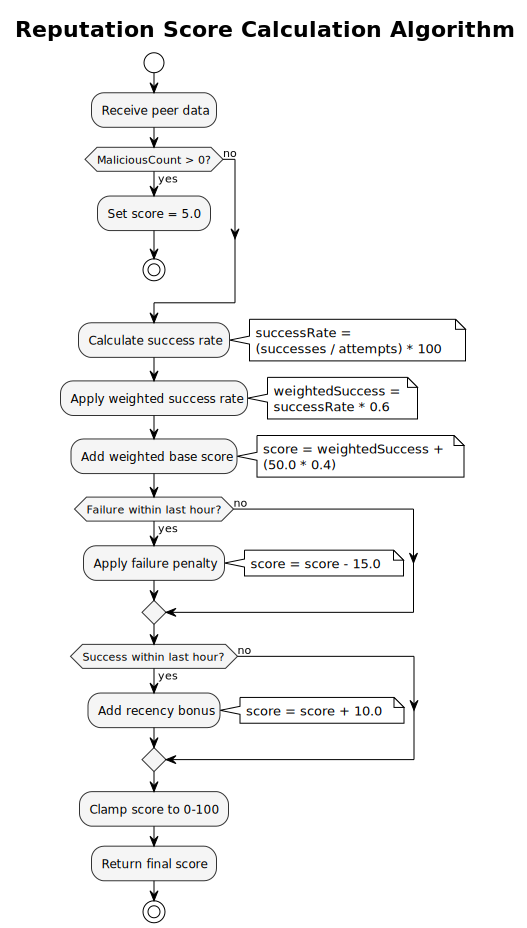
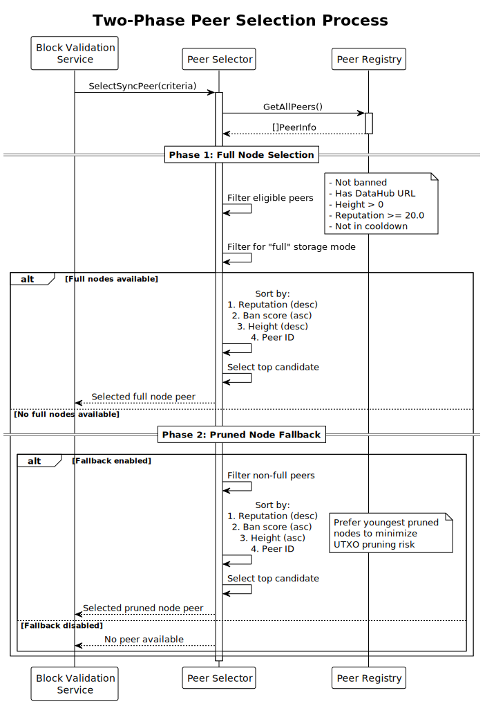
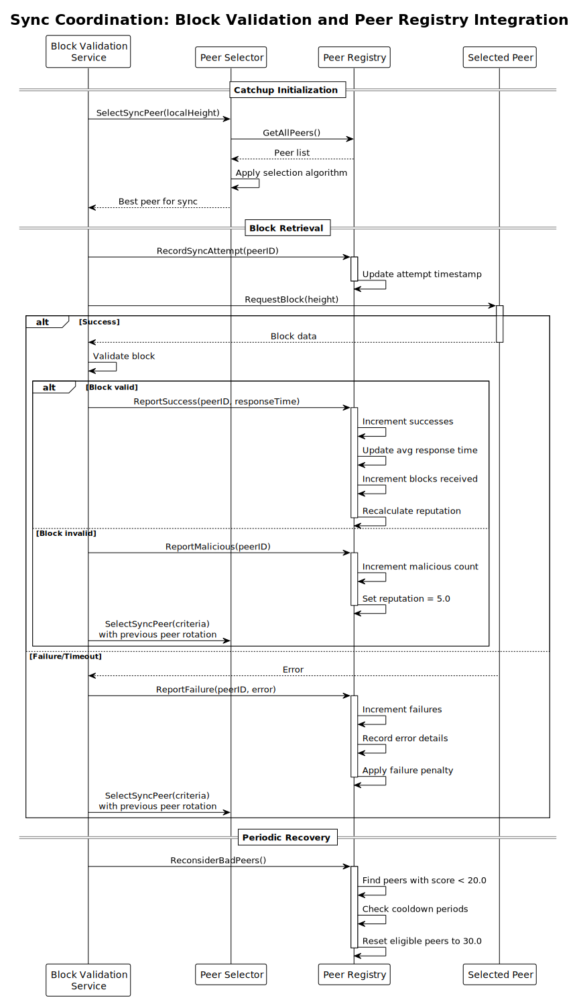

# Peer Registry and Reputation System

## Index

1. [Overview](#1-overview)
2. [Purpose and Benefits](#2-purpose-and-benefits)
3. [Core Components](#3-core-components)
    - [3.1. Peer Registry](#31-peer-registry)
    - [3.2. Peer Selector](#32-peer-selector)
    - [3.3. Reputation Scoring](#33-reputation-scoring)
4. [Reputation Algorithm](#4-reputation-algorithm)
    - [4.1. Score Calculation](#41-score-calculation)
    - [4.2. Scoring Events](#42-scoring-events)
    - [4.3. Malicious Behavior Detection](#43-malicious-behavior-detection)
5. [Peer Selection Strategy](#5-peer-selection-strategy)
    - [5.1. Selection Criteria](#51-selection-criteria)
    - [5.2. Two-Phase Selection](#52-two-phase-selection)
    - [5.3. Fallback to Pruned Nodes](#53-fallback-to-pruned-nodes)
6. [Integration with Other Services](#6-integration-with-other-services)
    - [6.1. Block Validation Service](#61-block-validation-service)
    - [6.2. Subtree Validation Service](#62-subtree-validation-service)
7. [Persistence and Recovery](#7-persistence-and-recovery)
    - [7.1. Cache File Format](#71-cache-file-format)
    - [7.2. Reputation Recovery](#72-reputation-recovery)
8. [Configuration Options](#8-configuration-options)
9. [Dashboard Monitoring](#9-dashboard-monitoring)
10. [Related Documentation](#10-related-documentation)

## 1. Overview

The Peer Registry and Reputation System is a comprehensive peer management framework introduced in Teranode to track, evaluate, and select the most reliable peers for network operations. This system replaces the previous ad-hoc peer health checking with a centralized registry that maintains detailed metrics about each peer's behavior, performance, and reliability.

The system consists of three main components:

- **Peer Registry**: A thread-safe data store that tracks all peer information and interaction history
- **Peer Selector**: A stateless component that selects optimal peers based on reputation and other criteria
- **Reputation Scoring**: An algorithm that calculates peer reliability scores (0-100) based on success rates, response times, and behavior patterns

This architecture enables intelligent peer selection for critical operations like blockchain synchronization (catchup), ensuring that Teranode preferentially interacts with reliable peers while avoiding problematic ones.

## 2. Purpose and Benefits

The Peer Registry and Reputation System addresses several critical needs in Teranode's P2P networking:

### Network Reliability

- **Intelligent Peer Selection**: Rather than randomly selecting peers, the system chooses the most reliable peers based on historical performance data
- **Malicious Peer Isolation**: Peers that provide invalid data are quickly identified and deprioritized
- **Graceful Degradation**: The system can recover from temporary peer issues through reputation recovery mechanisms

### Performance Optimization

- **Response Time Tracking**: The system maintains weighted averages of peer response times to prefer faster peers
- **Reduced Wasted Effort**: By avoiding unreliable peers, the system minimizes failed network operations
- **Efficient Catchup**: Block synchronization preferentially uses peers with proven track records

### Operational Visibility

- **Comprehensive Metrics**: Detailed tracking of interactions, successes, failures, and malicious behavior
- **Persistent History**: Peer metrics survive node restarts through cache persistence
- **Dashboard Integration**: Real-time peer monitoring through the UI dashboard

### Security Benefits

- **Sybil Attack Mitigation**: Reputation requirements make it costly for attackers to establish trusted peer identities
- **Invalid Block Protection**: Peers providing invalid blocks see immediate and severe reputation penalties
- **Automatic Recovery**: The system can reconsider previously bad peers after cooldown periods

## 3. Core Components

### 3.1. Peer Registry

The `PeerRegistry` is a thread-safe data store that maintains comprehensive information about all known peers. It acts as a pure data store with no business logic, providing atomic operations for peer data management.

**Key Data Tracked:**

| Field | Type | Description |
|-------|------|-------------|
| `ID` | `peer.ID` | Unique peer identifier |
| `ClientName` | `string` | Human-readable client software name |
| `Height` | `int32` | Peer's reported blockchain height |
| `BlockHash` | `string` | Hash of peer's best block |
| `DataHubURL` | `string` | URL for fetching blocks/subtrees from peer |
| `Storage` | `string` | Storage mode: "full", "pruned", or empty |
| `ReputationScore` | `float64` | Overall reliability score (0-100) |
| `IsConnected` | `bool` | Whether peer is directly connected |
| `IsBanned` | `bool` | Whether peer is currently banned |

**Interaction Metrics:**

| Field | Type | Description |
|-------|------|-------------|
| `InteractionAttempts` | `int64` | Total interactions attempted |
| `InteractionSuccesses` | `int64` | Successful interactions |
| `InteractionFailures` | `int64` | Failed interactions |
| `MaliciousCount` | `int64` | Detected malicious behaviors |
| `AvgResponseTime` | `time.Duration` | Weighted average response time |
| `BlocksReceived` | `int64` | Blocks successfully received |
| `SubtreesReceived` | `int64` | Subtrees successfully received |
| `TransactionsReceived` | `int64` | Transactions received |

### 3.2. Peer Selector

The `PeerSelector` is a stateless, pure-function component that implements the peer selection algorithm. It takes a list of peers and selection criteria, returning the optimal peer for a given operation.

**Selection Criteria:**

```go
type SelectionCriteria struct {
    LocalHeight         int32         // Current local blockchain height
    ForcedPeerID        peer.ID       // Force selection of specific peer
    PreviousPeer        peer.ID       // Previously selected peer (for rotation)
    SyncAttemptCooldown time.Duration // Cooldown before retrying a peer
}
```

### 3.3. Reputation Scoring

The reputation scoring system assigns each peer a score between 0 and 100, where:

- **100**: Perfect reliability
- **50**: Neutral (default for new peers)
- **20**: Minimum threshold for eligibility
- **5**: Malicious peer score
- **0**: Completely unreliable

## 4. Reputation Algorithm

### 4.1. Score Calculation

The reputation algorithm calculates scores based on multiple factors:

```text
Score = (SuccessRate * 0.6) + (BaseScore * 0.4) - RecentFailurePenalty + RecencyBonus
```



**Algorithm Constants:**

| Constant | Value | Description |
|----------|-------|-------------|
| `baseScore` | 50.0 | Starting neutral score |
| `successWeight` | 0.6 | Weight for success rate component |
| `maliciousPenalty` | 20.0 | Penalty per malicious detection |
| `recencyBonus` | 10.0 | Bonus for recent success |
| `recencyWindow` | 1 hour | Time window for recency calculations |

**Calculation Steps:**

1. If peer has malicious count > 0, score is immediately set to 5.0
2. Calculate success rate: `(successes / total_attempts) * 100`
3. Apply weighted success rate: `successRate * 0.6`
4. Add weighted base score: `50.0 * 0.4`
5. Apply recent failure penalty (-15.0) if failure within last hour
6. Add recency bonus (+10.0) if success within last hour
7. Clamp final score to 0-100 range

### 4.2. Scoring Events

Different events affect reputation scores differently:

**Positive Events:**

| Event | Effect |
|-------|--------|
| Successful block received | Increases success count, updates avg response time |
| Successful subtree received | Increases success count, updates avg response time |
| Transaction received | Increases success count |
| Successful catchup | Increases success count, updates avg response time |

**Negative Events:**

| Event | Effect |
|-------|--------|
| Interaction failure | Increases failure count |
| Multiple recent failures | Score drops to 15.0 (harsh penalty) |
| Catchup error | Tracks error message and time |

### 4.3. Malicious Behavior Detection

When a peer provides invalid data (e.g., invalid blocks), they are marked as malicious:

1. `MaliciousCount` is incremented
2. `InteractionFailures` is incremented
3. Reputation score is immediately set to 5.0
4. Peer becomes ineligible for selection (below 20.0 threshold)

**Recovery from Malicious Status:**

Malicious peers can be reconsidered after a cooldown period through the `ReconsiderBadPeers` function, which:

- Only affects peers with reputation < 20.0
- Requires sufficient time since last failure
- Applies exponential cooldown based on reset count (triples each time)
- Resets reputation to 30.0 (below neutral but above threshold)
- Clears malicious count for fresh start

## 5. Peer Selection Strategy

### 5.1. Selection Criteria

Peers must meet all eligibility criteria to be selected:

1. **Not Banned**: Peer must not be in the ban list
2. **Has DataHub URL**: Required for fetching blocks/subtrees (excludes listen-only nodes)
3. **URL Responsive**: DataHub URL must be accessible
4. **Valid Height**: Must report a positive blockchain height
5. **Minimum Reputation**: Score must be >= 20.0
6. **Cooldown Period**: Must not have been attempted recently (if cooldown is set)

### 5.2. Two-Phase Selection

The peer selector uses a two-phase approach for optimal selection:



#### Phase 1: Full Node Selection

1. Filter for peers that explicitly announce as "full" storage mode
2. Sort candidates by:

   - Reputation score (highest first) - **primary**
   - Ban score (lowest first) - **secondary**
   - Block height (highest first) - **tertiary**
   - Peer ID (for deterministic ordering) - **quaternary**
3. Select the top candidate (or second if top was previous peer)

#### Phase 2: Pruned Node Fallback

If no full nodes are available and fallback is enabled:

1. Filter for peers not in "full" mode but meeting other criteria
2. Sort by:

   - Reputation score (highest first)
   - Ban score (lowest first)
   - Block height (lowest first) - **prefer youngest pruned nodes**
   - Peer ID

The preference for younger pruned nodes minimizes UTXO pruning risk during catchup.

### 5.3. Fallback to Pruned Nodes

Pruned node fallback is controlled by the `p2p_allow_pruned_node_fallback` setting:

- **Enabled (default)**: Falls back to pruned nodes when no full nodes available
- **Disabled**: Only uses full nodes, fails if none available

When using pruned nodes:

- Warning is logged about potential UTXO pruning risk
- Youngest (lowest height) pruned node is preferred
- Reputation still prioritized over height

## 6. Integration with Other Services



### 6.1. Block Validation Service

The Block Validation service uses the peer registry extensively during catchup operations:

**Sync Coordination:**

- Records sync attempts via `RecordSyncAttempt`
- Uses `SelectSyncPeer` to choose optimal peers for block fetching
- Reports successes/failures to update reputation
- Handles malicious peer detection for invalid blocks

**Catchup Status:**

The service tracks catchup status including:

- Currently syncing peer
- Peer selection metrics
- Available peer counts by storage mode

### 6.2. Subtree Validation Service

The Subtree Validation service reports valid subtree receipts to improve peer reputation:

- Calls `ReportValidSubtree` after successful subtree validation
- Increases peer's reputation for providing valid data
- Tracks subtrees received per peer

## 7. Persistence and Recovery

### 7.1. Cache File Format

The peer registry persists its data to `teranode_peer_registry.json`:

```json
{
  "version": "1.0",
  "last_updated": "2025-11-19T10:30:00Z",
  "peers": {
    "QmPeerID1...": {
      "interaction_attempts": 150,
      "interaction_successes": 145,
      "interaction_failures": 5,
      "reputation_score": 87.5,
      "avg_response_ms": 250,
      "blocks_received": 100,
      "height": 850000,
      "data_hub_url": "https://peer1.example.com",
      "storage": "full"
    }
  }
}
```

**Persistence Triggers:**

- Periodic saves during operation
- Graceful shutdown
- Significant state changes

**Load on Startup:**

- Reads cache file if present
- Validates version compatibility
- Restores peer metrics to registry
- Handles legacy field formats for backward compatibility

### 7.2. Reputation Recovery

The system includes mechanisms for recovering peers from low reputation:

**Automatic Recovery (`ReconsiderBadPeers`):**

- Called periodically by sync coordinator
- Resets reputation to 30.0 after cooldown period
- Uses exponential backoff: cooldown * 3^(reset_count)
- Clears malicious count for fresh start

**Manual Reset (`ResetReputation`):**

- Available via gRPC API and dashboard UI
- Can reset specific peer or all peers
- Clears all interaction metrics
- Resets score to neutral 50.0

## 8. Configuration Options

| Setting | Default | Description |
|---------|---------|-------------|
| `p2p_allow_pruned_node_fallback` | `true` | Allow fallback to pruned nodes during sync |
| `p2p_cache_dir` | `.` | Directory for peer registry cache file |

**Related Settings:**

Additional settings that interact with the peer system are documented in the [P2P Settings Reference](../../references/settings/services/p2p_settings.md).

## 9. Dashboard Monitoring

The Teranode dashboard provides real-time visibility into peer status:

**Peer List View:**

- All connected peers with their metrics
- Reputation scores and storage modes
- Interaction history (successes, failures)
- Response time statistics

**Admin Operations:**

- **Reset Reputation**: Clear metrics for specific peer or all peers
- **Ban/Unban**: Manage peer bans
- **Force Disconnect**: Remove problematic peers

**Catchup Status:**

- Current sync peer and progress
- Available peer counts by storage mode
- Error tracking for sync failures

## 10. Related Documentation

- [P2P Service Documentation](../services/p2p.md)
- [P2P Service Reference](../../references/services/p2p_reference.md)
- [P2P Settings Reference](../../references/settings/services/p2p_settings.md)
- [Block Validation Service Documentation](../services/blockValidation.md)
- [Subtree Validation Service Documentation](../services/subtreeValidation.md)
